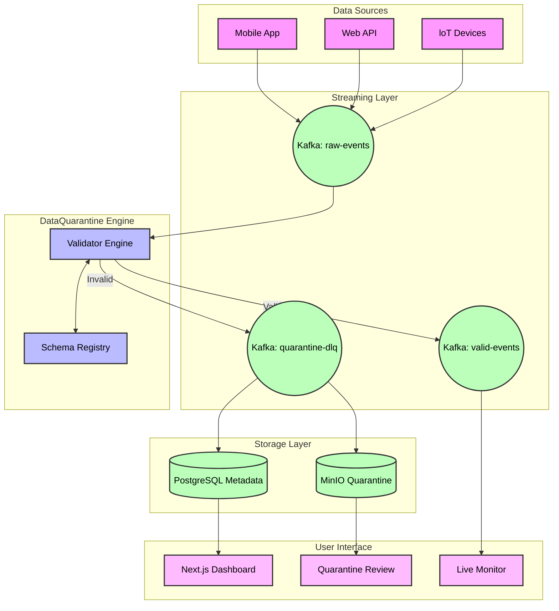

# DataQuarantine - Streaming Schema Enforcer


## 🎯 Overview

**DataQuarantine** is a production-ready streaming schema enforcement system that validates, quarantines, and monitors data quality in real-time streaming pipelines. It acts as a data quality gateway, ensuring only valid data flows through your pipeline while capturing and managing invalid records for review and reprocessing.

---

## 📚 Documentation

**📖 Complete Documentation**: [11 essential guides](docs/INDEX.md) - clean, organized, no redundancy.

### Quick Links
| Getting Started | Architecture | Testing & Interview |
|----------------|--------------|---------------------|
| [⚡ Quick Start (3 steps)](docs/STARTUP_GUIDE.md) | [🏗️ High-Level Design](docs/HLD.md) | [✅ Live Testing Guide](docs/LIVE_TESTING_NOW.md) |
| [🚀 Detailed Setup](docs/QUICKSTART.md) | [🔧 Low-Level Design](docs/LLD.md) | [💼 Interview Prep](docs/INTERVIEW_PREP.md) |
| [🎨 UI Documentation](docs/UI_DOCUMENTATION.md) | [📊 Data Flow](docs/FLOW.md) | [💰 Business Cases](docs/USE_CASES.md) |

---

## 🚀 Key Features

### Core Capabilities
- **Real-time Schema Validation**: Validate streaming data against JSON Schema, Avro, or custom schemas
- **Intelligent Quarantine**: Automatically isolate invalid records with detailed error context
- **Multi-Source Support**: Works with Kafka, AWS Kinesis, Google Pub/Sub, and more
- **Flexible Schema Management**: Version-controlled schemas with backward compatibility checks
- **Data Quality Metrics**: Real-time monitoring of validation rates, error types, and trends

### Advanced Features
- **Auto-Remediation**: Configurable rules to automatically fix common data issues
- **Quarantine Review UI**: Web interface to review, edit, and reprocess quarantined records
- **Alert System**: Configurable alerts for schema violations and quality degradation
- **Audit Trail**: Complete lineage tracking for compliance and debugging
- **Performance Optimized**: Handles high-throughput streams with minimal latency

## 🏗️ Architecture



## 📋 Use Cases

1. **Data Pipeline Quality Gates**: Ensure only valid data enters your data warehouse
2. **Compliance & Governance**: Enforce data contracts and regulatory requirements
3. **ML Pipeline Protection**: Prevent invalid data from corrupting model training
4. **API Data Validation**: Validate incoming API events before processing
5. **ETL Error Handling**: Centralized error handling for streaming ETL pipelines

## 🛠️ Technology Stack

- **Core Engine**: Python 3.9+ with asyncio for high-performance streaming
- **Schema Validation**: jsonschema, fastavro, pydantic
- **Streaming**: kafka-python, boto3 (Kinesis), google-cloud-pubsub
- **Storage**: PostgreSQL (metadata), S3/MinIO (quarantine storage)
- **Monitoring**: Prometheus metrics, Grafana dashboards
- **Web UI**: Next.js 14 + TypeScript + Tailwind CSS (modern, animated dashboard)
- **Backend API**: FastAPI for quarantine review interface
- **Deployment**: Docker, Kubernetes-ready

## 🚦 Quick Start

### Prerequisites
- Python 3.9+
- Docker & Docker Compose
- Kafka (or other streaming platform)

### Installation

```bash
# Clone the repository
git clone https://github.com/yourusername/dataquarantine.git
cd dataquarantine

# Create virtual environment
python -m venv venv
source venv/bin/activate  # On Windows: venv\Scripts\activate

# Install dependencies
pip install -r requirements.txt

# Set up environment variables
cp .env.example .env
# Edit .env with your configuration

# Start infrastructure (Kafka, PostgreSQL, etc.)
docker-compose up -d

# Initialize database
python scripts/init_db.py

# Run the enforcer
python -m dataquarantine.main
```

### Basic Usage

```python
from dataquarantine import SchemaEnforcer, KafkaSource, KafkaSink

# Define your schema
schema = {
    "type": "object",
    "properties": {
        "user_id": {"type": "string"},
        "timestamp": {"type": "string", "format": "date-time"},
        "temperature": {"type": "number", "minimum": -50, "maximum": 150}
    },
    "required": ["user_id", "timestamp", "temperature"]
}

# Create enforcer
enforcer = SchemaEnforcer(
    source=KafkaSource(topic="raw-events"),
    valid_sink=KafkaSink(topic="validated-events"),
    schema=schema,
    quarantine_enabled=True
)

# Start processing
enforcer.start()
```

## 📊 Configuration

### Schema Definition

Schemas are defined in `schemas/` directory:

```yaml
# schemas/user_event.yaml
version: "1.0.0"
name: "user_event"
type: "json_schema"
schema:
  type: object
  properties:
    user_id:
      type: string
      pattern: "^[A-Z0-9]{10}$"
    event_type:
      type: string
      enum: ["login", "logout", "purchase"]
    timestamp:
      type: string
      format: date-time
  required:
    - user_id
    - event_type
    - timestamp

# Validation rules
rules:
  - name: "future_timestamp_check"
    type: "custom"
    expression: "timestamp <= now()"
    error_message: "Timestamp cannot be in the future"
```

### Quarantine Configuration

```yaml
# config/quarantine.yaml
quarantine:
  enabled: true
  storage:
    type: "s3"  # or "local", "minio"
    bucket: "data-quarantine"
    prefix: "invalid-records/"
  
  retention:
    days: 30
    auto_delete: true
  
  alerts:
    - type: "email"
      threshold: 100  # Alert if >100 records/hour quarantined
      recipients: ["data-team@company.com"]
    
    - type: "slack"
      threshold: 1000
      webhook_url: "${SLACK_WEBHOOK_URL}"
```

## 📈 Monitoring

DataQuarantine exposes Prometheus metrics:

- `dataquarantine_records_processed_total`: Total records processed
- `dataquarantine_records_valid_total`: Valid records count
- `dataquarantine_records_quarantined_total`: Quarantined records count
- `dataquarantine_validation_duration_seconds`: Validation latency
- `dataquarantine_schema_errors_by_type`: Errors grouped by type

Access Grafana dashboard at `http://localhost:3001` (default credentials: admin/admin)

## 🎨 Quarantine Review UI

Access the **modern Next.js dashboard** at `http://localhost:3000`:

- **Dashboard**: Real-time metrics with animated charts and glassmorphism design
- **Records Browser**: Search, filter, and paginate quarantined records
- **Live Monitor**: Real-time message stream visualization
- **Schema Viewer**: Browse and validate schemas
- **System Status**: Monitor all services health

**Features**:
- ✨ Modern, animated UI with Framer Motion
- 🎨 Glassmorphism and gradient effects
- 📊 Interactive charts with Recharts
- 🌙 Dark mode optimized
- ⚡ Real-time updates
- 📱 **Mobile Responsive**: Optimized for phones and tablets

## 🧪 Testing

```bash
# Run unit tests
pytest tests/unit

# Run integration tests
pytest tests/integration

# Run with coverage
pytest --cov=dataquarantine tests/

# Load testing
python tests/performance/load_test.py
```

## 📦 Deployment

### Docker

```bash
# Build image
docker build -t dataquarantine:latest .

# Run container
docker run -d \
  --name dataquarantine \
  -e KAFKA_BOOTSTRAP_SERVERS=kafka:9092 \
  -e POSTGRES_URL=postgresql://user:pass@db:5432/quarantine \
  dataquarantine:latest
```

### Kubernetes

```bash
# Deploy to Kubernetes
kubectl apply -f k8s/

# Check status
kubectl get pods -l app=dataquarantine

# View logs
kubectl logs -f deployment/dataquarantine
```

## 🔧 Advanced Configuration

### Custom Validators

```python
from dataquarantine.validators import BaseValidator

class CustomBusinessRuleValidator(BaseValidator):
    def validate(self, record):
        # Your custom validation logic
        if record.get('amount', 0) > 10000 and not record.get('approved'):
            return False, "High-value transaction requires approval"
        return True, None

# Register custom validator
enforcer.add_validator(CustomBusinessRuleValidator())
```

### Auto-Remediation Rules

```python
from dataquarantine.remediation import RemediationRule

# Auto-fix common issues
rules = [
    RemediationRule(
        name="trim_whitespace",
        condition=lambda r: isinstance(r.get('name'), str),
        action=lambda r: {**r, 'name': r['name'].strip()}
    ),
    RemediationRule(
        name="default_country",
        condition=lambda r: 'country' not in r,
        action=lambda r: {**r, 'country': 'US'}
    )
]

enforcer.set_remediation_rules(rules)
```

## 🤝 Contributing

Contributions are welcome! Please see [CONTRIBUTING.md](CONTRIBUTING.md) for guidelines.

## 📄 License

This project is licensed under the MIT License - see [LICENSE](LICENSE) file for details.

## 🙏 Acknowledgments

- Inspired by data quality challenges in production streaming pipelines
- Built with best practices from the data engineering community

## 📞 Support

- **Documentation**: [https://dataquarantine.readthedocs.io](https://dataquarantine.readthedocs.io)
- **Issues**: [GitHub Issues](https://github.com/yourusername/dataquarantine/issues)
- **Discussions**: [GitHub Discussions](https://github.com/yourusername/dataquarantine/discussions)

---

**Built with ❤️ for data quality**
