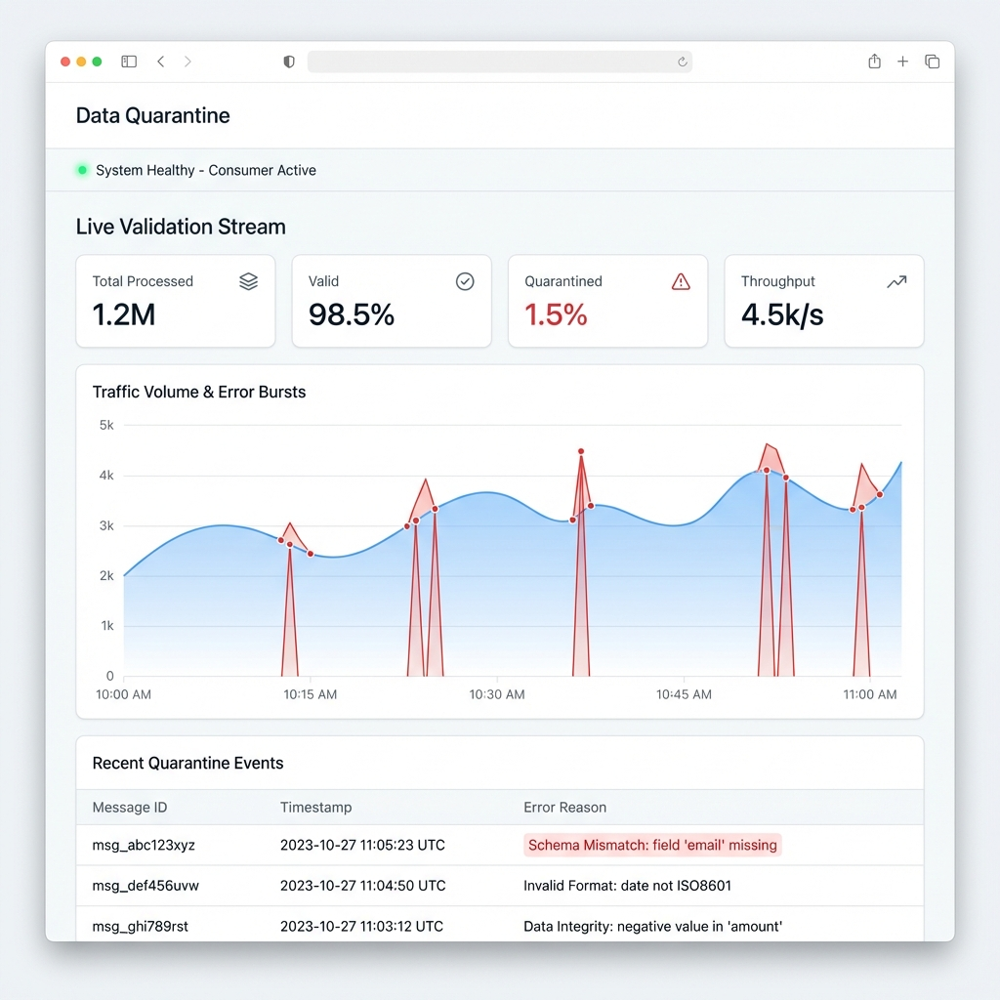
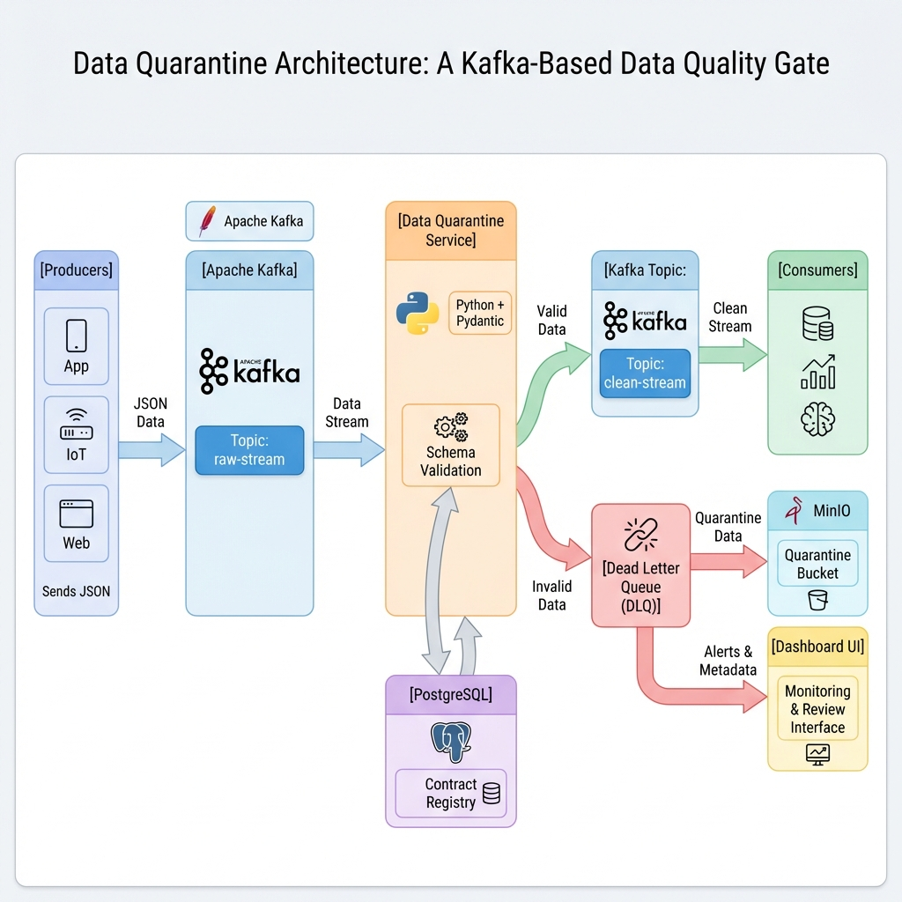

# DataQuarantine


## Streaming Schema Enforcer & Data Quality Gateway

<div align="center">


</div>

**DataQuarantine** is a production-grade **Data Quality Firewall**. It intercepts streaming data, enforces strict schema contracts in real-time, and isolates invalid records into a **Dead Letter Queue (DLQ)** without stopping the pipeline.

---

## 🚀 Quick Start

Get the entire stack (Kafka + Validator + UI) running in 2 steps:

```powershell
# 1. Automated Setup Script (PowerShell)
.\start.ps1
```
> **What this does**: Starts 8 Docker containers, creates Kafka topics, initializes Postgres/MinIO, and launches the dashboard.

**Access Points**:
*   **Dashboard**: `http://localhost:3000`
*   **Kafka UI**: `http://localhost:8090`
*   **Grafana**: `http://localhost:3001`

> **Detailed Setup**: See [GETTING_STARTED.md](./docs/GETTING_STARTED.md).

---

## 📸 Demo & Architecture

### Data Quality Dashboard

*Real-time monitoring of validation rates and schema health*

### System Architecture

*Valid data → Clean Topic | Invalid data → DLQ & Review*

> **Deep Dive**: See [ARCHITECTURE.md](./docs/ARCHITECTURE.md) for the "Claim Check" and "DLQ" patterns.

---

## ✨ Key Features

*   **🛡️ Real-time Enforcement**: Validates JSON/Avro streams against Pydantic models.
*   **☣️ Dead Letter Queue**: Automatically isolates bad data. "Poison Pills" never crash compliance.
*   **📦 Hybrid Storage**: Uses **Claim Check Pattern** (Postgres for Metadata, MinIO for Payloads).
*   **📊 Review & Replay**: UI tools to fix quarantined data and re-inject it into the stream.

---

## 📚 Documentation

| Document | Description |
| :--- | :--- |
| [**System Architecture**](./docs/ARCHITECTURE.md) | DLQ Pattern, Claim Check, and HLD. |
| [**Getting Started**](./docs/GETTING_STARTED.md) | 3-Command setup and Simulation guide. |
| [**Failure Scenarios**](./docs/FAILURE_SCENARIOS.md) | Zero Data Loss strategies. |
| [**Interview Q&A**](./docs/INTERVIEW_QA.md) | "Why Kafka?" and "Schema Evolution". |

---

## 🔧 Tech Stack

| Component | Technology | Role |
| :--- | :--- | :--- |
| **Stream** | **Apache Kafka** | Durable Event Log. |
| **Validator** | **Python (Pydantic)** | Type-safe schema validation. |
| **Storage** | **PostgreSQL + MinIO** | Hybrid Metadata/Object store. |
| **Frontend** | **Next.js 14** | Operations Dashboard. |

---

## 👤 Author

**Harshan Aiyappa**  
Senior Full-Stack Hybrid Engineer  
[GitHub Profile](https://github.com/Kimosabey)

---

## 📝 License

This project is licensed under the MIT License - see the [LICENSE](LICENSE) file for details.
