# DataQuarantine
## Streaming Schema Enforcer & Data Quality Gateway

<div align="center">


**Tech Stack**


**Patterns**


</div>

---

## 🚀 Quick Start

### 1. Start Support Infrastructure
```bash
docker-compose up -d
# Wait ~30s for Kafka/Zookeeper to initialize
```

### 2. Verify Services
```bash
docker ps
# Ensure all 8 containers are UP
```

### 3. Access Interfaces
| Service | URL | Credentials |
| :--- | :--- | :--- |
| **Dashboard** | http://localhost:3000 | - |
| **Grafana** | http://localhost:3001 | admin / admin |
| **Kafka UI** | http://localhost:8090 | - |
| **MinIO** | http://localhost:9001 | minioadmin / minioadmin |

---

## 📸 Screenshots

### Data Quality Dashboard
<p align="center">
  
</p>
*Real-time monitoring of validation rates and schema health*

### Intelligent Routing Flow
<p align="center">
  
</p>
*Valid data → Clean Topic | Invalid data → DLQ & Review*

---

## ✨ Key Features

### 🛡️ Schema Enforcement
- **Real-time Validation**: Validates JSON/Avro streams against defined schemas.
- **Dead Letter Queue (DLQ)**: Automatically isolates bad data without stopping the pipeline.

### 🔍 Reliability & Recovery
- **Quarantine Management**: Store invalid payloads in MinIO + PostgreSQL metadata.
- **Reprocessing**: Tools to fix and replay messages from the DLQ.

### 📊 Observability
- **Prometheus Metrics**: Track validation success rates, error types, and throughput.
- **Audit Trail**: Full lineage tracking of every decision.

---

## 🏗️ Architecture

```mermaid
graph TB
    Source[📱 Sources] -->|Events| Kafka[📨 Kafka: raw-events]
    Kafka -->|Consume| Engine[⚙️ Validator Engine]
    Engine <-->|Fetch| Schema[📋 Schema Registry]
    
    Engine -->|✅ Valid| ValidTopic[kafka: valid-events]
    Engine -->|❌ Invalid| DLQ[kafka: quarantine-dlq]
    
    DLQ -->|Payload| MinIO[📦 MinIO Storage]
    DLQ -->|Metadata| DB[🗄️ PostgreSQL]
    
    DB --> Dashboard[🖥️ Next.js Dashboard]
    ValidTopic --> Analytics[📊 Downstream Analytics]
```



### Valid Message Flow
1. **Producer** sends event to `raw-events`.
2. **Validator** checks schema contract.
3. **Success**: Published to `valid-events` for downstream usage.

### Available Schemas
- `user_event`: Tracking user actions (view, click).
- `transaction`: Financial records validation.

---

## 📖 Use Cases

### 1. IoT Sensor Networks
Reject and log corrupted sensor readings without crashing the analytics pipeline.

### 2. E-Commerce Clickstreams
Ensure schema evolution doesn't break machine learning feature pipelines.

### 3. Financial Compliance
Maintain a perfect audit trail of all accepted and rejected transactions.

---

## 🚨 Failure Scenarios

| Scenario | System Behavior |
| :--- | :--- |
| **Kafka Outage** | Validators pause, resume from last offset (Zero Data Loss). |
| **DB Failure** | Fail-open or buffer metadata (Configurable). |
| **Schema Registry Down** | Use local cache or reject-all (Safety First). |

---

## 🔧 Tech Stack

| Component | Technology | Purpose |
| :--- | :--- | :--- |
| **Streaming** | Kafka / Redpanda | High-throughput message backbone |
| **Validation** | Pydantic / Python | Type-safe schema logic |
| **Storage** | PostgreSQL + MinIO | Hybrid metadata & object storage |
| **UI** | Next.js 14 | Real-time Operations Dashboard |
| **Ops** | Docker Compose | GitOps-ready deployment |

---

## 🧪 Testing Checklist

- [ ] **Infrastructure**: All containers UP (`docker ps`)
- [ ] **Kafka**: Topics created (`raw-events`, `dlq`)
- [ ] **Flow**: Send invalid message, check MinIO bucket
- [ ] **UI**: Validate record appears in Quarantine tab

---

## 📚 Documentation

- **[Quick Start Guide](./docs/QUICKSTART.md)** - Detailed setup instructions
- **[Architecture Deep Dive](./docs/ARCHITECTURE.md)** - System design choices
- **[Interview Q&A](./docs/INTERVIEW.md)** - Defending the design

---

## 🚀 Future Enhancements

- [ ] Schema Registry UI editor
- [ ] Webhook notifications for high error rates
- [ ] Protobuf support
- [ ] Kubernetes Helm chart
- [ ] Role-Based Access Control (RBAC)

---

## 📝 License

MIT License - See [LICENSE](./LICENSE) for details

---

## 👤 Author

**Harshan Aiyappa**  
Senior Full-Stack Engineer  
📧 [GitHub](https://github.com/Kimosabey)

---

**Built with**: Kafka • Python • PostgreSQL • MinIO • Next.js
