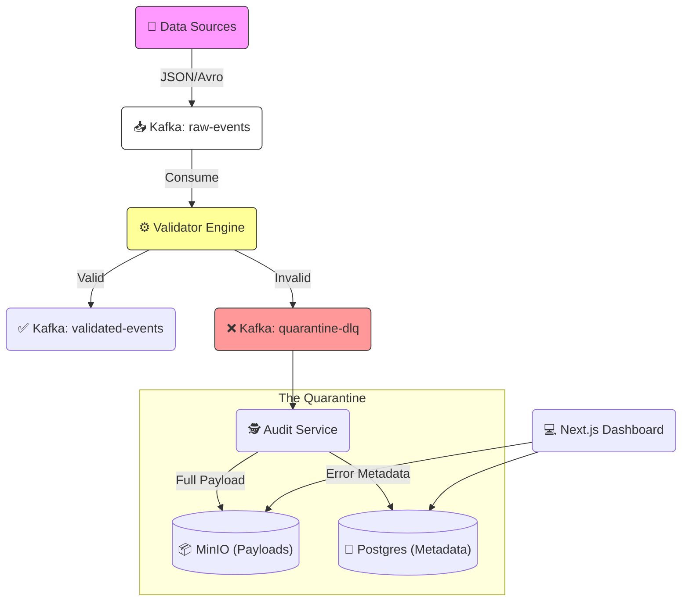

# 🏗️ System Architecture

## 1. High-Level Design (HLD)

DataQuarantine implements a **Dead Letter Queue (DLQ) Pattern** to act as a quality gateway for streaming data. It enforces schema contracts in real-time, splitting data into "Clean" and "Quarantined" streams without stopping the pipeline.


```mermaid
graph TD
    %% Nodes
    Source("📱 Data Sources")
    KafkaIn("📥 Kafka: raw-events")
    Validator("⚙️ Validator Engine")
    KafkaOut("✅ Kafka: validated-events")
    KafkaDLQ("❌ Kafka: quarantine-dlq")
    
    subgraph "The Quarantine"
        DLQ_Consumer("🕵️ Audit Service")
        MinIO[("📦 MinIO (Payloads)")]
        Postgres[("💾 Postgres (Metadata)")]
    end
    
    Dashboard("💻 Next.js Dashboard")

    %% Flows
    Source -->|JSON/Avro| KafkaIn
    KafkaIn -->|Consume| Validator
    Validator -- Valid --> KafkaOut
    Validator -- Invalid --> KafkaDLQ
    
    KafkaDLQ --> DLQ_Consumer
    DLQ_Consumer -->|"Full Payload"| MinIO
    DLQ_Consumer -->|"Error Metadata"| Postgres
    
    Dashboard --> Postgres
    Dashboard --> MinIO

    %% Styling
    style Source fill:#f9f,stroke:#333
    style KafkaIn fill:#fff,stroke:#333
    style Validator fill:#ff9,stroke:#333
    style KafkaDLQ fill:#f99,stroke:#333
```

### Core Components
1.  **Validator Engine (Python)**: The core service. Validates distinct message types against Pydantic models.
2.  **Kafka Topics**:
    *   `raw-events`: The input funnel.
    *   `validated-events`: The clean stream for downstream analytics.
    *   `quarantine-dlq`: The "Hospital" for bad data.
3.  **Storage Layer**:
    *   **PostgreSQL**: Stores metadata (Error type, Source ID, Timestamp, Replay Status). ACID compliant for audit logs.
    *   **MinIO**: Stores specific heavy payloads (JSON blobs) that failed validation.
4.  **Dashboard (Next.js)**: A UI for Data Engineers to inspect, fix, and replay quarantined messages.

---

## 2. Low-Level Design (LLD)

### Data Schema (PostgreSQL)
We split metadata from payload to keep the DB fast.
**Table: `quarantine_records`**
*   `id`: UUID
*   `error_type`: Enum (`SCHEMA_VIOLATION`, `MISSING_FIELD`)
*   `source_topic`: String
*   `s3_key`: Link to MinIO payload
*   `status`: Enum (`NEW`, `REVIEWED`, `REPLAYED`)

### Validation Logic (Python)
We use a **Multi-Layer Validation** strategy:
1.  **Structural**: Is it valid JSON?
2.  **Schema**: Does it match the Pydantic Model?
3.  **Business Logic**: Are timestamps in the past? Is `amount > 0`?

```python
try:
    event = UserEvent(**msg) # Pydantic Validation
    send_to_stream(event)
except ValidationError as e:
    send_to_dlq(msg, error=e.json())
```

---

## 3. Decision Log

| Decision | Alternative | Reason for Choice |
| :--- | :--- | :--- |
| **Kafka** | RabbitMQ | **Replayability**. Kafka allows us to replay the `raw-events` stream to test new schemas on old data. RabbitMQ deletes messages after consumption. |
| **MinIO + Postgres** | Postgres Only | **Performance**. Storing massive JSON blobs in Postgres bloats the WAL and slows down metadata queries. We use the "Claim Check Pattern" (Metadata in DB, Payload in S3). |
| **Pydantic** | JSONSchema (Raw) | **Developer Experience**. Pydantic offers Pythonic type hints and faster execution (Rust core in v2). |
| **Next.js** | Streamlit | **Customizability**. We needed a highly interactive "Quarantine Browser" with complex filtering, which Streamlit handles poorly. |

---

## 4. Key Patterns

### Dead Letter Queue (DLQ)
Instead of crashing the consumer when it hits bad data (poison pill), we route it to a side channel (`quarantine-dlq`). This ensures the main pipeline **never blocks**.

### Claim Check Pattern
To avoid passing large payloads through the message bus or database unnecessarily, we store the payload in Object Storage (MinIO) and pass a reference (`s3_key`) to the database and UI.
