# DataQuarantine - Architecture Guide

**Project**: DataQuarantine  
**Type**: Streaming Schema Enforcer & Data Quality Gateway  
**Author**: Harshan Aiyappa

---

## 📐 System Architecture Overview

DataQuarantine implements a production-grade streaming schema enforcement system using the **Dead Letter Queue (DLQ) pattern** for data quality management.

### Core Architecture Pattern: DLQ (Dead Letter Queue)

The system acts as a **data quality gateway** between raw event sources and downstream consumers:

```
Raw Events → Validator Engine → Clean Events (✅ Valid)
                              → Quarantine DLQ (❌ Invalid)
```

---

## 🏗️ Component Architecture

### High-Level Architecture


The system consists of 6 major layers:

### 1. **Data Sources Layer**
- Mobile Apps
- Web APIs  
- IoT Devices
- Third-party integrations

**Purpose**: Generate raw event streams

### 2. **Message Queue Layer (Kafka)**
Three topics for different event states:
- `raw-events` - Incoming unvalidated messages
- `validated-events` - Clean, schema-compliant messages
- `quarantine-dlq` - Invalid messages for review

**Technology**: Apache Kafka / Redpanda  
**Why Kafka?**
- Durability (no data loss)
- Scalability (horizontal partitioning)
- Replay capability
- Strong ordering guarantees

### 3. **Validation Engine**
The heart of the system - validates every message against defined schemas.

**Components:**
- **Validator Engine**: Core validation logic
- **Schema Registry**: Version-controlled schema management
- **Rule Engine**: Custom business rules

**Validation Flow:**
1. Consume message from `raw-events`
2. Fetch schema from registry
3. Validate against schema
4. Apply custom rules
5. Route to appropriate topic
6. Commit offset (prevent reprocessing)

**Technologies:**
- Python 3.11+
- Pydantic (type-safe validation)
- jsonschema (JSON Schema validation)
- Avro (optional, for performance)

### 4. **Storage Layer**

**PostgreSQL (Metadata Store)**  
Stores:
- Quarantine record metadata
- Validation error details
- Schema versions
- Audit logs

**MinIO (Object Storage)**  
Stores:
- Full quarantined message payloads
- Large invalid records
- Historical data for replay

**Why separate storage?**
- PostgreSQL: Fast queries, ACID compliance for metadata
- MinIO: Cost-effective, S3-compatible for large payloads

### 5. **Monitoring Stack**

**Prometheus** (Metrics Collection)
- Pull-based scraping
- Time-series metrics
- Alerting rules

**Grafana** (Visualization)
- Real-time dashboards
- Custom alerts
- Historical analysis

**Key Metrics:**
- Validation success rate
- Quarantine rate by error type
- Processing latency (p50, p95, p99)
- Kafka consumer lag
- Database connection pool status

### 6. **Frontend Layer (Next.js Dashboard)**

Modern UI for:
- Real-time metrics visualization
- Quarantine record browser
- Live message monitoring
- Schema management
- System health status

**Technologies:**
- Next.js 14
- TypeScript
- Framer Motion (animations)
- Recharts (visualization)
- Glassmorphism design

---

## 🔄 Data Flow Diagrams

### Happy Path: Valid Message

```mermaid
sequenceDiagram
    participant P as Producer
    participant K1 as Kafka: raw-events
    participant V as Validator Engine
    participant S as Schema Registry
    participant K2 as Kafka: valid-events
    
    P->>K1: Publish Message
    K1->>V: Consume
    V->>S: Get Schema
    S-->>V: Return Schema
    V->>K2: Publish to valid-events ✅
    V->>K1: Commit Offset
```



### Unhappy Path: Invalid Message (Quarantine)


---

## 📊 Validation Engine Deep Dive

### Schema Validation Process

```python
# Simplified validation logic
def validate_message(message: dict, schema_name: str) -> ValidationResult:
    # 1. Fetch schema
    schema = schema_registry.get_schema(schema_name)
    
    # 2. Validate structure
    try:
        validate(message, schema)  # jsonschema
    except ValidationError as e:
        return ValidationResult(
            valid=False,
            error_type="SCHEMA_VIOLATION",
            error_detail=str(e)
        )
    
    # 3. Apply custom rules
    for rule in schema.custom_rules:
        if not rule.evaluate(message):
            return ValidationResult(
                valid=False,
                error_type="BUSINESS_RULE_VIOLATION",
                error_detail=rule.error_message
            )
    
    return ValidationResult(valid=True)
```

### Error Classification

| Error Type | Severity | Action |
|------------|----------|--------|
| `SCHEMA_VIOLATION` | High | Quarantine, alert |
| `BUSINESS_RULE_VIOLATION` | Medium | Quarantine, log |
| `PARSE_ERROR` | High | Quarantine, alert |
| `MISSING_FIELD` | High | Quarantine |
| `TYPE_MISMATCH` | Medium | Auto-remediate (if possible) |

---

## 🔐 Reliability & Resilience

### Zero Data Loss Guarantee

**Strategy**: Manual offset commit after successful processing

```python
# Pseudo-code
for message in consumer:
    try:
        result = validate(message)
        
        if result.valid:
            producer.send("validated-events", message)
        else:
            producer.send("quarantine-dlq", message)
            store_in_minio(message)
            log_to_postgres(message)
        
        # Only commit if everything succeeds
        consumer.commit()
    except Exception as e:
        # Don't commit - message will be reprocessed
        log_error(e)
```

**Result**: If any step fails, Kafka offset is not committed → message reprocessed

### Failure Scenarios & Mitigations

**1. Kafka Broker Failure**
- **Mitigation**: Kafka replication (min 3 brokers)
- **Result**: No data loss, temporary unavailability

**2. PostgreSQL Failure**
- **Strategy**: Fail-open with degraded mode
- **Action**: Buffer metadata in-memory, log to file
- **Result**: Pipeline continues, metadata delayed

**3. MinIO Failure**
- **Strategy**: Local fallback storage
- **Action**: Write to local disk, background sync later
- **Result**: No data loss

**4. Validator Crash**
- **Strategy**: Kafka consumer groups
- **Action**: Another consumer in group takes over
- **Result**: Automatic failover

**5. High Error Rate (>50%)**
- **Strategy**: Circuit breaker
- **Action**: Alert, pause processing
- **Result**: Manual intervention required

---

## 🚀 Scalability Considerations

### Horizontal Scaling

**Kafka Partitioning:**
- Partition `raw-events` by `tenant_id` or `event_type`
- Each partition assigned to one consumer
- Add consumers to scale processing

**Example:**
```
Partition 0 → Consumer 1
Partition 1 → Consumer 2
Partition 2 → Consumer 3
```

**Throughput Math:**
- Single consumer: ~1000 msg/sec
- 10 partitions + 10 consumers: ~10,000 msg/sec

### Vertical Scaling

**Database:**
- PostgreSQL read replicas for queries
- Connection pooling (pgBouncer)
- Partitioning by date

**Object Storage:**
- MinIO supports distributed mode
- S3 is inherently scalable

---

## 🎨 Design Decisions & Trade-offs

### Why Kafka over AWS Kinesis or Google Pub/Sub?

**Pros:**
- ✅ Self-hosted (no cloud vendor lock-in)
- ✅ More control over partitioning
- ✅ Better for batch processing
- ✅ Lower cost at scale

**Cons:**
- ❌ More operational overhead
- ❌ Requires Zookeeper (complexity)

**Decision**: Kafka for on-prem, flexibility

### Why PostgreSQL over NoSQL?

**Pros:**
- ✅ ACID compliance for metadata
- ✅ Rich querying (complex filters)
- ✅ Relational data (schemas, versions)

**Cons:**
- ❌ Less scalable than NoSQL

**Decision**: ACID compliance > raw scalability for metadata

### Why Pydantic over pure jsonschema?

**Pros:**
- ✅ Type hints (IDE support)
- ✅ Data classes (easier to work with)
- ✅ Custom validators

**Cons:**
- ❌ Python-only (not language-agnostic)

**Decision**: Developer experience > portability

---

## 🔍 Monitoring & Observability

### Prometheus Metrics

```promql
# Validation Success Rate (5-minute window)
rate(dataquarantine_records_valid_total[5m]) / 
rate(dataquarantine_records_processed_total[5m])

# Quarantine Rate by Error Type
sum by (error_type) (dataquarantine_records_invalid_total)

# p99 Validation Latency
histogram_quantile(0.99, dataquarantine_validation_duration_seconds)

# Kafka Consumer Lag
dataquarantine_kafka_lag{topic="raw-events"}
```

### Alerting Rules

| Alert | Condition | Severity | Action |
|-------|-----------|----------|--------|
| High Error Rate | Error rate > 10% for 5min | Warning | Page on-call |
| Critical Error Rate | Error rate > 50% for 2min | Critical | Auto-pause |
| High Lag | Consumer lag > 10,000 msgs | Warning | Scale consumers |
| DB Connection Pool | Pool usage > 80% | Warning | Investigate |

---

## 📚 References & Further Reading

- [Kafka Documentation](https://kafka.apache.org/documentation/)
- [Dead Letter Queue Pattern](https://www.enterpriseintegrationpatterns.com/patterns/messaging/DeadLetterChannel.html)
- [JSON Schema Specification](https://json-schema.org/)
- [Pydantic Documentation](https://docs.pydantic.dev/)

---

**Built with ❤️ by Harshan Aiyappa**
