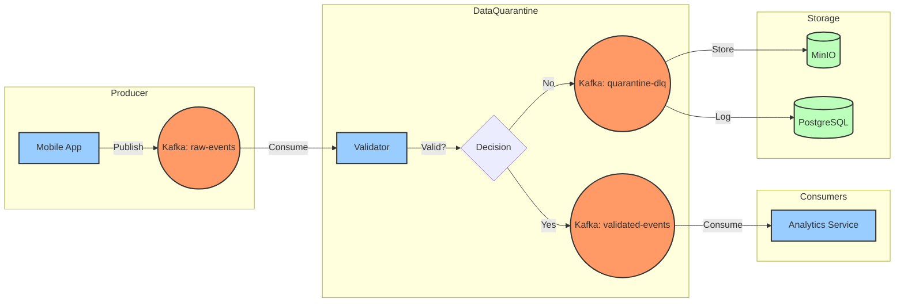
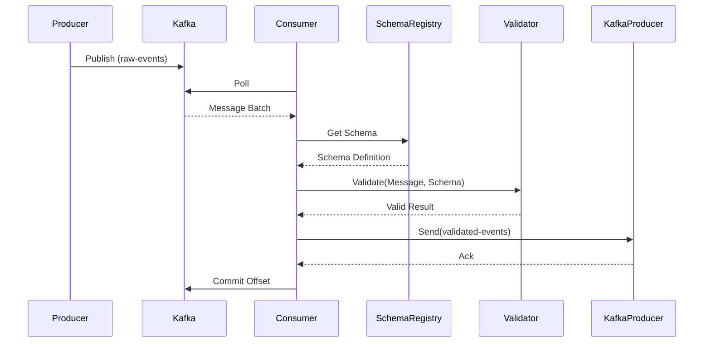
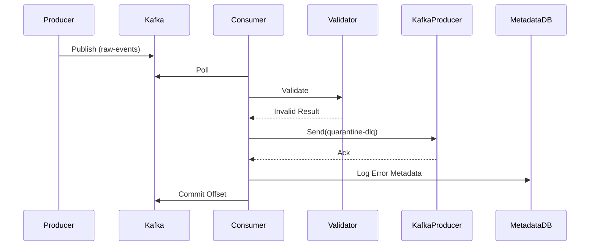
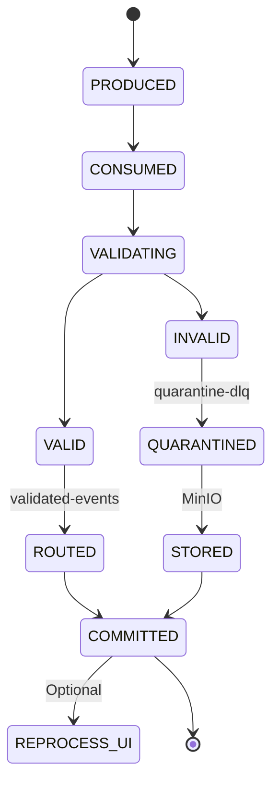

# DataQuarantine - End-to-End Flow

**Document Version**: 1.0  
**Purpose**: Complete walkthrough of data flow from producer to consumer  
**Audience**: Interviewers, Developers, Architects

---

## 1. Executive Summary

This document traces a **single message** through the entire DataQuarantine system, showing:
- ✅ Every component it touches
- ✅ Every validation step
- ✅ Every decision point
- ✅ Success and failure paths
- ✅ Timing and performance

**Use this for**: Interview demos, debugging, onboarding new engineers

---

## 2. High-Level Flow Diagram



---

## 3. Detailed End-to-End Flow

### Scenario: User Purchase Event

**Message**:
```json
{
  "_schema": "user_event",
  "user_id": "USER123456",
  "event_type": "purchase",
  "timestamp": "2025-12-27T16:00:00Z",
  "product_id": "PROD789",
  "session_id": "sess_abc123"
}
```

---

### Step 1: Producer Sends Message

**Component**: Mobile App / API

```python
# Producer code
from kafka import KafkaProducer
import json

producer = KafkaProducer(
    bootstrap_servers='localhost:9092',
    value_serializer=lambda v: json.dumps(v).encode('utf-8')
)

message = {
    "_schema": "user_event",
    "user_id": "USER123456",
    "event_type": "purchase",
    "timestamp": "2025-12-27T16:00:00Z",
    "product_id": "PROD789"
}

producer.send('raw-events', message)
producer.flush()
```

**What happens**:
1. Message serialized to JSON bytes
2. Sent to Kafka broker
3. Written to `raw-events` topic
4. Assigned to partition (based on hash of key, or round-robin)
5. Offset assigned (e.g., partition 0, offset 12345)

**Timing**: ~2-5ms

**Kafka State**:
```
Topic: raw-events
Partition: 0
Offset: 12345
Message: {"_schema":"user_event",...}
```

---

### Step 2: DataQuarantine Consumes Message

**Component**: `KafkaMessageConsumer`

```python
# Consumer polls for messages
async for message in consumer.consume_batch():
    # Message received
    {
        "value": {...},  # The actual message
        "topic": "raw-events",
        "partition": 0,
        "offset": 12345,
        "timestamp": 1735315200000,
        "key": None
    }
```

**What happens**:
1. Consumer polls Kafka (max 500 messages per poll)
2. Message deserialized from bytes to dict
3. Message added to processing queue
4. **Offset NOT committed yet** (critical!)

**Timing**: ~1-2ms

**State**:
```
Consumer Group: dataquarantine-validators
Last Committed Offset: 12344
Current Position: 12345 (uncommitted)
```

---

### Step 3: Schema Lookup

**Component**: `SchemaRegistry`

```python
# Load schema
schema = await schema_registry.get_schema(
    schema_name="user_event",
    version="latest"
)
```

**What happens**:
1. Check in-memory cache for schema
2. **Cache hit** → Return cached schema (~0.1ms)
3. **Cache miss** → Load from filesystem (~5ms)
4. Parse YAML/JSON schema definition
5. Store in cache with TTL (5 minutes)

**Timing**: 
- Cache hit: ~0.1ms
- Cache miss: ~5ms

**Schema Loaded**:
```yaml
name: "user_event"
version: "1.0.0"
schema:
  type: object
  properties:
    user_id: {type: string, pattern: "^USER[0-9]{6}$"}
    event_type: {type: string, enum: ["view","click","purchase"]}
    timestamp: {type: string, format: date-time}
  required: [user_id, event_type, timestamp]
```

---

### Step 4: Validation

**Component**: `JSONSchemaValidator`

```python
# Validate message
is_valid, error = await validator.validate(message, schema)
```

**What happens**:
1. Get or create JSON Schema validator (cached)
2. Validate each field:
   - ✅ `user_id`: "USER123456" matches pattern `^USER[0-9]{6}$`
   - ✅ `event_type`: "purchase" is in enum
   - ✅ `timestamp`: "2025-12-27T16:00:00Z" is valid ISO 8601
   - ✅ All required fields present
3. Return validation result

**Timing**: ~1-3ms

**Validation Result**:
```python
ValidationOutcome(
    result=ValidationResult.VALID,
    error_type=None,
    error_message=None,
    field_path=None,
    remediated=False
)
```

**Metrics Emitted**:
```
dataquarantine_records_processed_total{topic="raw-events", schema="user_event"} +1
dataquarantine_records_valid_total{topic="raw-events", schema="user_event"} +1
dataquarantine_validation_duration_seconds{schema="user_event"} 0.002
```

---

### Step 5: Route to Valid Topic

**Component**: `KafkaMessageProducer`

```python
# Send to validated-events topic
await producer.send_message(
    topic="validated-events",
    value=message,
    key=message.get("user_id")  # Partition by user_id
)
```

**What happens**:
1. Serialize message to JSON bytes
2. Send to Kafka with `acks='all'` (wait for all replicas)
3. Kafka writes to `validated-events` topic
4. Acknowledgment received

**Timing**: ~3-5ms

**Kafka State**:
```
Topic: validated-events
Partition: 2 (hash of "USER123456")
Offset: 67890
Message: {"_schema":"user_event",...}
```

---

### Step 6: Commit Offset

**Component**: `KafkaMessageConsumer`

```python
# Commit offset (ONLY after successful processing)
await consumer.commit_offset(
    topic="raw-events",
    partition=0,
    offset=12345
)
```

**What happens**:
1. Tell Kafka: "I've successfully processed up to offset 12345"
2. Kafka stores committed offset in internal topic
3. If consumer crashes and restarts, it resumes from 12346

**Timing**: ~1-2ms

**State**:
```
Consumer Group: dataquarantine-validators
Last Committed Offset: 12345 ✅
Current Position: 12346
```

**🎯 KEY INSIGHT**: This is why we have **zero data loss**. If the process crashes before this step, the message is reprocessed.

---

### Step 7: Downstream Consumption

**Component**: Analytics Service

```python
# Analytics service consumes validated events
consumer = KafkaConsumer('validated-events')
for message in consumer:
    # Process clean, validated data
    analytics_db.insert(message.value)
```

**What happens**:
1. Analytics service consumes from `validated-events`
2. Data is **guaranteed valid** (already validated)
3. No need for defensive checks
4. Direct insertion into analytics database

**Timing**: Depends on downstream service

---

## 4. Invalid Message Flow (Failure Path)

### Scenario: Missing Required Field

**Message**:
```json
{
  "_schema": "user_event",
  "event_type": "purchase",
  "timestamp": "2025-12-27T16:00:00Z"
  // Missing: user_id (required field)
}
```

---

### Steps 1-3: Same as Valid Flow

Producer → Kafka → Consumer → Schema Lookup

---

### Step 4: Validation FAILS

**Component**: `JSONSchemaValidator`

```python
is_valid, error = await validator.validate(message, schema)
```

**Validation Result**:
```python
ValidationOutcome(
    result=ValidationResult.INVALID,
    error_type="schema_violation",
    error_message="'user_id' is a required property",
    field_path="user_id",
    remediated=False
)
```

**Metrics Emitted**:
```
dataquarantine_records_processed_total{topic="raw-events", schema="user_event"} +1
dataquarantine_records_invalid_total{topic="raw-events", schema="user_event", error_type="schema_violation"} +1
```

---

### Step 5: Route to DLQ

**Component**: `KafkaMessageProducer`

```python
# Create DLQ payload with error context
dlq_payload = {
    "original_message": message,
    "validation_error": {
        "error_type": "schema_violation",
        "error_message": "'user_id' is a required property",
        "field_path": "user_id"
    },
    "source_topic": "raw-events",
    "source_partition": 0,
    "source_offset": 12345,
    "quarantined_at": "2025-12-27T16:00:01Z"
}

# Send to DLQ topic
await producer.send_message(
    topic="quarantine-dlq",
    value=dlq_payload
)
```

**Kafka State**:
```
Topic: quarantine-dlq
Partition: 0
Offset: 456
Message: {original_message: {...}, validation_error: {...}}
```

---

### Step 6: Store in MinIO (Future)

**Component**: `QuarantineManager` (TODO)

```python
# Store full message in object storage
storage_path = "raw-events/0/12345_uuid.json"
await minio_client.put_object(
    bucket="data-quarantine",
    path=storage_path,
    data=json.dumps(dlq_payload)
)
```

**MinIO State**:
```
Bucket: data-quarantine
Path: raw-events/0/12345_uuid.json
Size: 512 bytes
```

---

### Step 7: Log Metadata in PostgreSQL (Future)

**Component**: `QuarantineMetadata` (TODO)

```sql
INSERT INTO quarantine_records (
    id,
    topic,
    partition,
    offset,
    timestamp,
    schema_name,
    schema_version,
    error_type,
    error_message,
    field_path,
    storage_path,
    status
) VALUES (
    'uuid-here',
    'raw-events',
    0,
    12345,
    '2025-12-27 16:00:00',
    'user_event',
    '1.0.0',
    'schema_violation',
    '''user_id'' is a required property',
    'user_id',
    'raw-events/0/12345_uuid.json',
    'quarantined'
);
```

**Database State**:
```
Table: quarantine_records
Rows: 1 new record
Indexes: Updated for fast querying
```

---

### Step 8: Commit Offset

Same as valid flow - offset committed after successful DLQ write.

---

## 5. Timing Breakdown

### Valid Message (Happy Path)

| Step | Component | Time | Cumulative |
|------|-----------|------|------------|
| 1. Producer Send | Kafka Producer | 2-5ms | 5ms |
| 2. Consumer Poll | Kafka Consumer | 1-2ms | 7ms |
| 3. Schema Lookup | Schema Registry | 0.1-5ms | 12ms |
| 4. Validation | JSON Schema | 1-3ms | 15ms |
| 5. Route to Valid | Kafka Producer | 3-5ms | 20ms |
| 6. Commit Offset | Kafka Consumer | 1-2ms | 22ms |
| **Total** | | | **~22ms** |

**p99 Latency**: < 50ms  
**p50 Latency**: < 20ms

### Invalid Message (Error Path)

| Step | Component | Time | Cumulative |
|------|-----------|------|------------|
| 1-3. Same as Valid | | 12ms | 12ms |
| 4. Validation | JSON Schema | 1-3ms | 15ms |
| 5. Route to DLQ | Kafka Producer | 3-5ms | 20ms |
| 6. Store MinIO | MinIO Client | 5-10ms | 30ms |
| 7. Log PostgreSQL | PostgreSQL | 2-5ms | 35ms |
| 8. Commit Offset | Kafka Consumer | 1-2ms | 37ms |
| **Total** | | | **~37ms** |

**Note**: Invalid messages take slightly longer due to additional storage operations.

---

## 6. Sequence Diagram (Valid Message)



---

## 7. Sequence Diagram (Invalid Message)



---

## 8. State Transitions

### Message State Machine



---

## 9. Data Flow by Component

### 9.1 Kafka Consumer

**Input**: Raw bytes from Kafka  
**Output**: Deserialized message dict

```python
# Input
raw_bytes = b'{"_schema":"user_event",...}'

# Processing
message = json.loads(raw_bytes.decode('utf-8'))

# Output
{
    "value": {...},
    "topic": "raw-events",
    "partition": 0,
    "offset": 12345
}
```

---

### 9.2 Schema Registry

**Input**: Schema name + version  
**Output**: Schema definition

```python
# Input
schema_name = "user_event"
version = "latest"

# Processing
1. Check cache
2. Load from filesystem if miss
3. Parse YAML/JSON
4. Cache with TTL

# Output
{
    "type": "object",
    "properties": {...},
    "required": [...]
}
```

---

### 9.3 Validator Engine

**Input**: Message + Schema  
**Output**: ValidationOutcome

```python
# Input
message = {"user_id": "USER123456", ...}
schema = {"type": "object", ...}

# Processing
1. Run JSON Schema validation
2. Check custom rules
3. Apply auto-remediation (if enabled)
4. Emit metrics

# Output
ValidationOutcome(
    result=VALID/INVALID/ERROR,
    error_type="...",
    error_message="..."
)
```

---

### 9.4 Kafka Producer

**Input**: Topic + Message  
**Output**: Acknowledgment

```python
# Input
topic = "validated-events"
message = {...}

# Processing
1. Serialize to JSON bytes
2. Send to Kafka
3. Wait for acks from all replicas

# Output
RecordMetadata(
    topic="validated-events",
    partition=2,
    offset=67890
)
```

---

## 10. Error Handling Flow

### What Happens When Things Fail?

#### Scenario 1: Kafka Broker Down

```
Consumer.poll() → ConnectionError
    ↓
Retry with exponential backoff
    ↓
If still failing after 3 retries:
    ↓
Log error + emit metric
    ↓
Sleep 5 seconds
    ↓
Retry indefinitely (consumer will reconnect)
```

**Result**: No data loss (offset not committed)

---

#### Scenario 2: Schema Not Found

```
SchemaRegistry.get_schema() → FileNotFoundError
    ↓
Return ValidationOutcome(ERROR, "schema_not_found")
    ↓
Send to DLQ with error context
    ↓
Commit offset
    ↓
Alert operators
```

**Result**: Message quarantined, not dropped

---

#### Scenario 3: PostgreSQL Down

```
PostgreSQL.insert() → DatabaseError
    ↓
Log to local fallback file
    ↓
Continue processing (fail-open)
    ↓
Background job syncs later
```

**Result**: Pipeline continues, metadata delayed

---

#### Scenario 4: Validator Crash

```
Process crashes mid-processing
    ↓
Offset NOT committed
    ↓
Kubernetes restarts pod
    ↓
Consumer resumes from last committed offset
    ↓
Message reprocessed
```

**Result**: At-least-once delivery, no data loss
